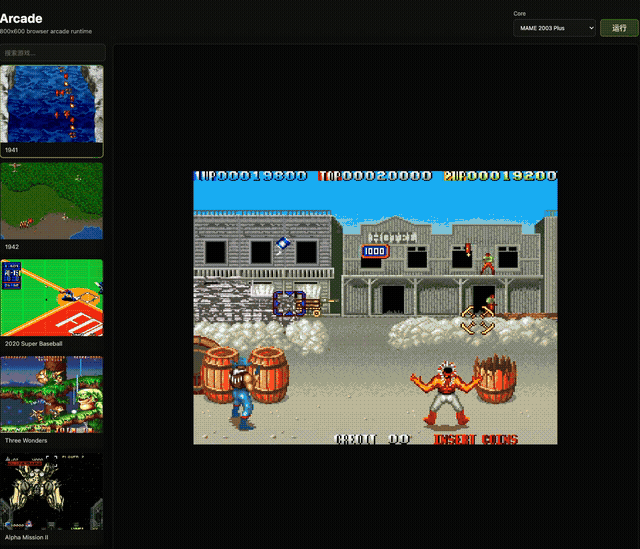

# Arcade


Browser arcade launcher built with TypeScript, Vite, and a locally hosted EmulatorJS runtime.

The app loads playable arcade ROM ZIPs from `roms/`, renders the emulator in an `800x600` screen, and uses local EmulatorJS core assets so it can run without fetching the emulator from a CDN.

## Features

- TypeScript frontend
- `800x600` arcade screen
- Local EmulatorJS runtime and arcade cores
- ROM selector limited to known playable games
- Keyboard controls for player 1
- Browser Gamepad API support for connected controllers
- One-command local startup with `start.sh`

## Controls

| Action | Keyboard |
| --- | --- |
| Up / Down / Left / Right | `W` / `S` / `A` / `D` |
| Start / Select | `Enter` |
| Insert coin | `1` |
| Button Y | `I` |
| Button X | `J` |
| Button B | `L` |
| Button A | `K` |

Gamepads are handled through the browser Gamepad API. Press any button on the controller after opening the page, then check EmulatorJS `Control Settings` if you need to remap inputs.




## Quick Start

```bash
./start.sh
```

Open:

```text
http://127.0.0.1:5173/
```

`start.sh` installs dependencies if `node_modules/` is missing, then starts the Vite dev server.

## Manual Commands

```bash
npm install
npm run dev -- --port 5173
npm run build
```

## ROMs

ROM files live in:

```text
roms/
```

The visible ROM dropdown is intentionally controlled by a playable whitelist in `src/main.ts` (`ROM_OVERRIDES`). This keeps BIOS files, platform packs, and dependency archives out of the game selector.

To expose another ROM in the dropdown, add an entry like:

```ts
newrom: { title: "Game Title", core: "fbneo", playable: true }
```

Supported local cores currently include:

- `fbneo`
- `mame2003`
- `mame2003_plus`

## Local EmulatorJS Assets

The EmulatorJS runtime is served from:

```text
public/emulatorjs-data/
```

Core runtime files are served from:

```text
public/emulatorjs-data/cores/runtime/
```

The local `loader.js` and `emulator.min.js` include compatibility patches for this project’s offline runtime and controller behavior.

## Legal Note

This project does not grant rights to any ROM, BIOS, game asset, trademark, or copyrighted game software. Only use ROMs and BIOS files that you are legally allowed to use.

## ROM Download

Download the complete ROM set from https://pan.baidu.com/s/1iyrv_vqcHBlLDtiWjrkk3g?pwd=5rp7
